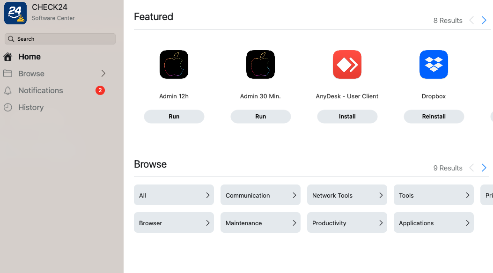
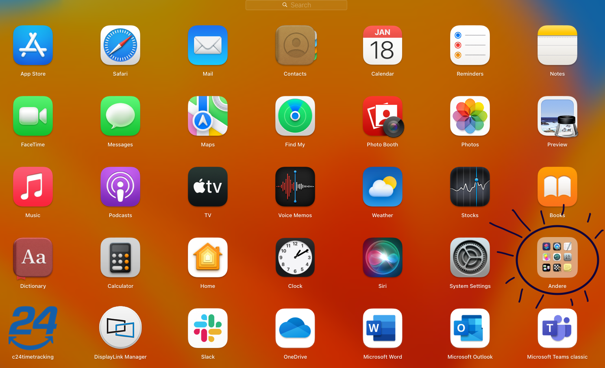
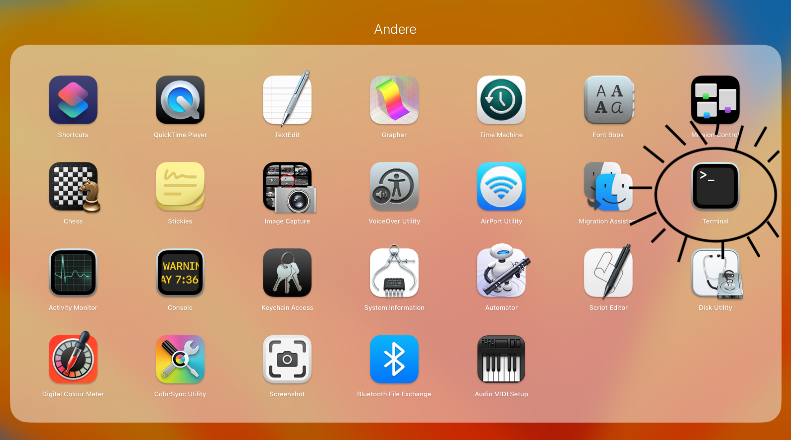
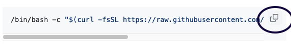
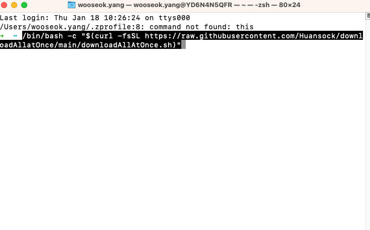

# Alles einmal herunterladen (Download all at Once )

  [English version](#in-english)

Sie können slack, chrome, microsoft-365, zoom mit einem Kommandozeile herunterladen.

**Zuerst brauchen wir admin**



## Auf Deutsch

1. **Öffnen Sie Terminal**
   
   
   

2. **Kopieren Sie diese Befehl.**
    <br/>

    ```bash
    /bin/bash -c "$(curl -fsSL https://raw.githubusercontent.com/Huansock/downloadAllatOnce/main/downloadAllAtOnce.sh)"
    ```
    <br/>
    Sie können einfach hier klicken.

     

3. **Fügen Sie den Befehl in Terminal ein. Drucken Sie die Eingabetaste.**


4. **Wenn Sie alle Apps aktualisieren möchten, nutzen Sie diese Befehl.**
```bash
brew update
```

## In English

you can download microsoft-365, slack, chrome, zoom at once!

1. **Open Terminal**


2. **Copy this command.**


```bash
/bin/bash -c "$(curl -fsSL https://raw.githubusercontent.com/Huansock/downloadAllatOnce/main/downloadAllAtOnce.sh)"
```
<br/>

You can simply click here.


3. **Paste it in Terminal**

Paste the command into Terminal. Press the Enter key.


4. **If you want to update all apps, use this command.**

```bash
brew update
```